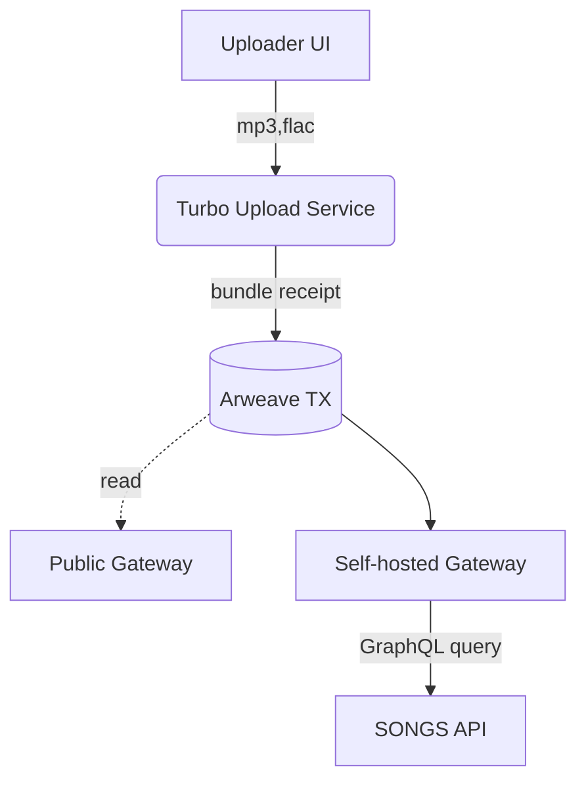

# SONGS Protocol × Arweave/AR.IO  
## Milestone M1 – Core Storage Integration

---

### 0. Project Reminder
See *M0‑public‑research.md* for the universal context table and repo links.

---

### 1. Milestone Summary
| Item | Value |
|------|-------|
| **Period** | Month 0 → 2 (8 weeks) |
| **Goal** | Migrate catalogue & switch uploads to AR.IO while exposing a reusable TypeScript SDK. |

**Definition of Done**  
- 500 legacy tracks permanently stored on Arweave via **Turbo → AR.IO gateway**.  
- Front‑end reads via self‑hosted gateway with automatic public fallback.  

---

### 2. Architecture Snapshot


### Notes
- songs-upload service wraps Turbo SDK; validates MIME tags, adds metadata tags (Content-Type, Artist, Album).
- Gateway G1 pinned at gateway.songs.tools behind Cloudflare for TLS only (no cache).

---

### 3. Detailed Work Packages

| # | Title | Output |
|---|-------|--------|
| 1 | Gateway provisioning | ansible/ar-io-node.yaml playbook |
| 2 | $ARIO staking | staking.tx.json – proof of stake TXID |
| 3 | Upload microservice | services/songs-upload Docker |
| 4 | Migration CLI | cli/migrate-catalogue.ts + report CSV |
| 5 | Contract patch | Solidity SongShare.sol stores arTxId |
| 6 | TypeScript SDK | packages/ar-storage-sdk (npm) |
| 7 | Front‑end integration | React hooks useTrack(txId) |
| 8 | Monitoring stack | Grafana dashboards imported |
| 9 | Load & fault tests | k6 script + results |
| 10 | Demo video | demos/demo-m1.mp4 (Arweave TX) |

---

### 4. Operational Requirements
| Resource | Minimum |
|----------|---------|
| Server | 8 vCPU, 32 GB RAM, 10 TB NVMe, 1 Gbps |
| OS | Ubuntu 22.04 LTS |
| AR.IO node ver. | v2.2.x |
| AR reserve | 30 AR (≈ 500 × 5 MB) |
| $ARIO stake | 5 000 (returnable) |

---

### 5. Deliverables & Repository Locations
| Deliverable | Path |
|-------------|------|
| Gateway Ansible roles | /infra/gateway |
| Upload service | /services/songs-upload |
| SDK source | /packages/ar-storage-sdk |
| Migration report | /reports/migration-500.csv |
| Demo video TXID | README#Migration-Demo |

---

### 6. Acceptance Matrix
| Check | Tool | Pass Threshold |
|-------|------|----------------|
| Catalogue migrated ≥ 95 % | CSV diff script | ✅ |
| Gateway latency p95 < 400 ms | k6 + Prometheus | ✅ |
| Upload path points to new flow | Cypress e2e | ✅ |

---

### 7. Risk Table
| Risk | Impact | Plan |
|------|--------|------|
| Gateway unsynced | Uploads blocked | Alert if sync height lag > 20 blocks |
| AR price spike | Budget overshoot | everPay hedge + dynamic fee calc |
| Turbo throttling | Slow migration | Batch 100 tracks/tx bundle |

---

### 8. Command Examples

```bash
# Provision AR.IO node
ansible-playbook infra/gateway/ar-io-node.yaml -e "target=gw-prod-1"

# Upload a track (manual test)
turbo upload ./tracks/lofi.mp3 \
  --tag App=SONGS --tag Artist="DJ Lofi" --wallet ~/.arconnect.json

# Migrate legacy catalogue
npm --workspace cli run migrate -- --limit 500
``` 